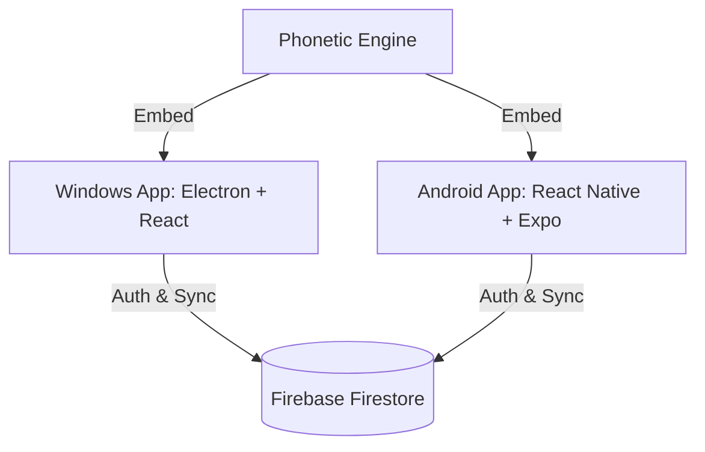

# 📝 Kalam Notes Ecosystem

<div align="center">


[](https://github.com/DilpreetSinghVerma/kalam-notes)
[](https://github.com/DilpreetSinghVerma/kalam-mobile-Notes)
[](https://firebase.google.com/)
[](https://www.electronjs.org/)

**A cross-platform writing ecosystem with phonetic Punjabi/Hindi transliteration and real-time cloud sync.**  
*Type phonetically in English, write naturally in Indic scripts.*

</div>

---

## 🇮🇳 Why Kalam Notes?

Writing in native Indic scripts (Punjabi, Hindi) on standard keyboards is incredibly frustrating. You either need to master complex layout mappings or rely on copy-pasting from web translators.

**Kalam Notes** provides a native, fluid transliteration engine. As you type phonetically (e.g., typing `satsriakal` or `namaste`), it converts the text **in real-time** into native Gurmukhi (`ਸਤਿ ਸ੍ਰੀ ਅਕਾਲ`) or Devanagari (`नमस्ते`) scripts. Your notes sync instantly between your desktop (Windows) and phone (Android).

---

## ✨ Core Features

- **✍️ Real-Time Transliteration:** Instant phonetic typing for Hindi & Punjabi without switching keyboard layouts.
- **🔄 Firebase Cloud Sync:** Seamless, real-time database synchronization. Write a note on your PC and finish it on your phone instantly.
- **📡 Offline Mode:** Write notes offline; the app automatically queue-syncs updates the moment you reconnect.
- **📁 Categorization & Tags:** Keep your writing, journaling, and code snippets organized with custom tags and color coding.
- **🖤 Modern Dark Theme:** Comfortable, high-contrast dark environment designed for long writing sessions.

---

## 🛠️ System Architecture



- **Desktop client:** Electron, React, Tailwind CSS, JavaScript/TypeScript.
- **Mobile client:** React Native, Expo, Native Base elements.
- **Database & Services:** Firebase Authentication, Firestore Database, Firebase Offline Persistence.

---

## 📦 Setting Up Locally

The Kalam Notes ecosystem is split into two repositories:

### A. Desktop (Electron)
1. **Clone the desktop repository:**
   ```bash
   git clone https://github.com/DilpreetSinghVerma/kalam-notes.git
   cd kalam-notes
   ```
2. **Install dependencies:**
   ```bash
   npm install
   ```
3. **Configure Firebase:**  
   Create a `src/firebaseConfig.js` file and fill in your Web App config credentials:
   ```javascript
   export const firebaseConfig = {
     apiKey: "YOUR_API_KEY",
     authDomain: "YOUR_AUTH_DOMAIN",
     projectId: "YOUR_PROJECT_ID",
     storageBucket: "YOUR_STORAGE_BUCKET",
     messagingSenderId: "YOUR_MESSAGING_SENDER_ID",
     appId: "YOUR_APP_ID"
   };
   ```
4. **Run the Electron App:**
   ```bash
   npm start
   ```

### B. Mobile (React Native + Expo)
1. **Clone the mobile repository:**
   ```bash
   git clone https://github.com/DilpreetSinghVerma/kalam-mobile-Notes.git
   cd kalam-mobile-Notes
   ```
2. **Install dependencies:**
   ```bash
   npm install
   ```
3. **Start the Expo server:**
   ```bash
   npx expo start
   ```
4. Scan the QR code using the **Expo Go** app on your Android device to run the app.

---

## 🤝 Connect

- Portfolio: [dilpreet-webresume.vercel.app](https://dilpreet-webresume.vercel.app)
- Email: [dilpreetsinghverma@gmail.com](mailto:dilpreetsinghverma@gmail.com)
- LinkedIn: [Dilpreet Singh](https://linkedin.com/in/dilpreet-singh-709b35310)
